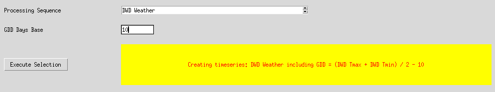
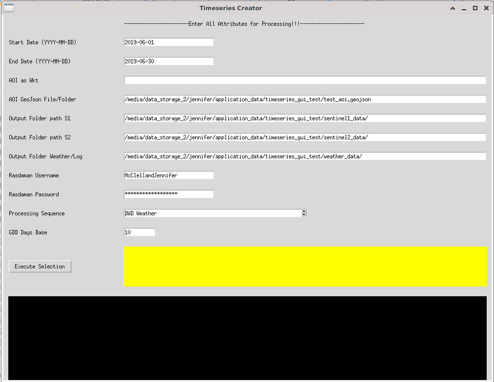

### Authors
[Jennifer McClelland](https://gitea.julius-kuehn.de/Jennifer.McClelland),
[Florian Beyer](https://gitea.julius-kuehn.de/Florin.Beyer), Date 2024-08-08, Version 0.1 beta

## Georeferenced timeseries Generator

The App automates the processing of timeseries for diverse Rasdaman layers according to multipolygons defined by either a
single geojson or folder of geojsons. The output results in user dedicated folders. 
The output coordinate system is 25832 and file types raster .geotiff and table .csv.

Can be executed directly via the executable "timeseries_generator" on Linux!!! (please give feedback on this)

Following timeseries can be generated:

1. Radiometrically terrain corrected (RTC) backscatter (-,+ range) VH/VV output bands.
    The source layers 'codede_gamma0XascXs1gg_irregular' and 'codede_gamma0XascXs1gg_irregular' are in a spatio-temporally consistent 10 × 10 m² grid, the EPSG is 25832.
   
   - In a dedicated subfolder named "raw", dual Band VH/VV raster geotiff timeseries are created.
   - In a dedicated subfolder named "rvi_ras" single band normalised RVI raster geotiff timeseries are created.
   
3. Sentinel 2 optical data with bands: 01_Blue, 02_Green, 03_Red, 04_RE1, 05_RE2, 06_RE3, 07_NIR10, 08_NIR20, 09_SWIR1, 10_SWIR2
    The source layer 'codede_reflectanceXboaXs2gg_irregular'is in a spatio-temporally consistent 10 × 10 m² grid, the EPSG is 25832.

    - In a dedicated subfolder named "raw", 10 Band raster geotiff timeseries are created.
    - In a dedicated subfolder named "ndvi_ras" single band normalised RVI raster geotiff timeseries are created.
   
3. DWD daily precipitation (unknown unit), daily medium temperature, daily minimum temperature and daily maximum temperature as well as the GDD with a given base in Degree. 
    The source layers 'dwd_precipitation_daily', 'dwd_temperatureXaverage_daily', 'dwd_temperatureXminimum_daily' and 'dwd_temperatureXmaximum_daily' 
    are in a spatio-temporally consistent 1 x 1 km² grid, the EPSG is 25832. Access to these layers are prone to changes on the Rasdman database server.

## Usage Instructions

On startup a user setting .xml file is created in the overlying folder. Here all gui defined settings are stored and reloaded.
On each run a logfile is created containing the execution output of the series generation. 
This is a subfolder "/log_output" in the defined weather folder. 
Csv Files listing the amount of pixel per returned raster geotiff file are also created in the main folder for each timeseries request.

When running the app from a shell use the --noGui argument to run over the precreated setting file without using the gui!!!

Command: `python3 timeseries_generator.py --noGui`

There is an additional execution option, where activation is performed in fill table mode. 
When activated, the derived data is automatically entered into a predefined PostGreSQL table. 
For this, the modules of the CreateAgriRefDatabase repository must be accessible as well
as a pre-created table named by the name given in the SQL_TABLE_NAME macro. The CROP_TYPE macro defines the relevant 
crop type of the applied geojson areas. The FROM_POINT macro flag defines the option of working on geojsons
containing points instead of polygons and the POINT_BB defines the size of the bounding box to create around the point.

To start execution in the "fill table" mode, the gui can not be used. Execute the command as following in a terminal of
choice running on a Code-De VM.

Command: `python3 timeseries_generator.py --noGui --fillTable`

Following information must be given:

- Start date in format yyyy-mm-dd
- End date in format yyyy-mm-dd
- The user name of a Rasdaman account
- The password of the users account
- Either a multipolygon in wkt format (a geojson will be created and saved on first entry to be reloaded)
- Otherwise, a path to either a geojson containing a multipolygon or a folder with multiple geojsons containung such.
- The desired folder path to the S2 timeseries
- The desired folder path to the S1 timeseries
- The desired folder path to the csv files containing DWD weather timeseries and log files
- Following processing modi can be selected: S1 only, S2 only, S1/2 combined, DWD weather only, All
- The base temperature is required when derving the DWD weather timeseries for the calculation of the GDD

For each geosjon a subfolder is created for the time series when executed.

## Required Python Packages

The Python packages/versions required to run this app are following:

- python                    3.9.10
- rasterio                  1.3.10                   
- requests                  2.27.1             
- numpy                     1.24.4                   
- xmltodict                 0.13.0                   
- geojson                   2.5.0   
- pyproj                    3.3.0            
- shapely                   1.8.0
- lxml

For linux to use the executable the packages must be in an environment here: /opt/anaconda3/envs/env_basic/lib/

## DWD Weather csv File Structure

Derived from https://datacube.julius-kuehn.de/flf/ows#/services

Order:

- DWD_Niederschlag (dwd_precipitation_daily)
- DWD_Temp_Tagesmittel (dwd_temperatureXaverage_daily)
- DWD_Temp_Tagesminimum (dwd_temperatureXminimum_daily)
- DWD_Temp_Tagesmaximum (dwd_temperatureXmaximum_daily)
- GDD_5 with given base via: `GDD = (Tmax + Tmin) / 2 - T` with Tmax from dwd_temperatureXmaximum_daily and Tmin from dwd_temperatureXminimum_daily

The first Row/Header contain the dates of the data in YYYY-MM-DD format, the second contains the precipitation of the days in integer, 
the third contains the medium temperature as integer.

